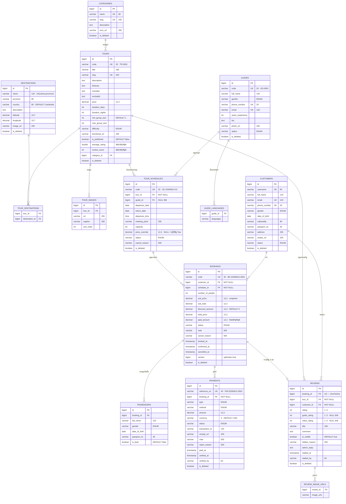

# Tour Management — ERD ពេញលេញ (Entity Relationship Diagram)

> ឯកសារនេះពង្រីក §០.៨ នៃ [`pseudo-code.md`](./pseudo-code.md) ឲ្យក្លាយជា **ផែនទីទិន្នន័យពេញលេញ** — គ្រប់តារាង · គ្រប់ column · គ្រប់ទំនាក់ទំនង · គ្រប់ index។
>
> - **Base package** : `co.panha.hibernate.tourmanagement`
> - **Database** : PostgreSQL · Hibernate `ddl-auto=update`
> - ឈ្មោះ column ក្នុងឯកសារនេះជា **snake_case** (លទ្ធផលពី Spring `CamelCaseToUnderscoresNamingStrategy`)
> - មើលដំណើរអ្នកប្រើនៅ [`ux-flow.md`](./ux-flow.md)

---

## មាតិកា

| # | ផ្នែក |
|---|---|
| ១ | ដ្យាក្រាមរួម (Mermaid) |
| ២ | បញ្ជីតារាងទាំង ១៤ |
| ៣ | BaseEntity — column រួមគ្រប់តារាង |
| ៤ | តារាងលម្អិតម្តងមួយៗ |
| ៥ | ទំនាក់ទំនងលម្អិត (Cardinality · FK · Cascade) |
| ៦ | Enum ទាំង ៩ |
| ៧ | Unique Constraint និង Index |
| ៨ | Field គណនាទុកមុន (Denormalized) |
| ៩ | Soft Delete · Locking · Audit |
| ១០ | SQL DDL សង្ខេប |
| ១១ | ចំណុចប្រុងប្រយ័ត្ន |

---

## ១. ដ្យាក្រាមរួម



### ១.១ ទិដ្ឋភាព ASCII (សម្រាប់កន្លែងដែល Mermaid មិនបង្ហាញ)

```
                    ┌────────────┐
                    │ categories │
                    └─────┬──────┘
                          │ 1
                          │
                          ▼ N                      N ┌──────────────┐
  ┌───────────┐   N   ┌───────┐   N ────────────────>│ destinations │
  │tour_images│<──────│ tours │<── tour_destinations  └──────────────┘
  └───────────┘   1   └───┬───┘   N
                          │ 1                    ┌────────┐
                          │                      │ guides │
                          ▼ N                    └───┬────┘
                   ┌────────────────┐   N            │ 1
                   │ tour_schedules │<───────────────┘
                   └───────┬────────┘
                           │ 1
                           │
        ┌────────────┐     ▼ N
        │ customers  │──1─>┌──────────┐──1──> N ┌────────────┐
        └─────┬──────┘  N  │ bookings │         │ passengers │
              │ 1          └────┬─────┘         └────────────┘
              │                 │ 1
              │                 ├──────> N ┌──────────┐
              │                 │          │ payments │
              │                 │          └──────────┘
              │                 │ 1
              │                 └──────> 1 ┌─────────┐
              │                            │ reviews │<── N ─┐
              └──────────────── N ────────>└────┬────┘       │
                                                │ 1       tours (1)
                                                ▼ N
                                      ┌────────────────────┐
                                      │ review_image_urls  │
                                      └────────────────────┘
```

---

## ២. បញ្ជីតារាងទាំង ១៤

| # | តារាង | ប្រភេទ | Entity | Base |
|---|---|---|---|---|
| ១ | `categories` | មេ | `Category` | ✅ |
| ២ | `destinations` | មេ | `Destination` | ✅ |
| ៣ | `guides` | មេ | `Guide` | ✅ |
| ៤ | `guide_languages` | ElementCollection | — | ❌ |
| ៥ | `tours` | មេ | `Tour` | ✅ |
| ៦ | `tour_images` | កូន | `TourImage` | ❌ |
| ៧ | `tour_destinations` | Join (M:N) | — | ❌ |
| ៨ | `tour_schedules` | ប្រតិបត្តិការ | `TourSchedule` | ✅ |
| ៩ | `customers` | មេ | `Customer` | ✅ |
| ១០ | `bookings` | ប្រតិបត្តិការ | `Booking` | ✅ |
| ១១ | `passengers` | កូន | `Passenger` | ❌ |
| ១២ | `payments` | ប្រតិបត្តិការ | `Payment` | ✅ |
| ១៣ | `reviews` | ប្រតិបត្តិការ | `Review` | ✅ |
| ១៤ | `review_image_urls` | ElementCollection | — | ❌ |

> ⚠️ តារាង ElementCollection ទាំង ២ ប្រើឈ្មោះ **លំនាំដើមរបស់ Hibernate**។ សូមកំណត់ច្បាស់ដោយ `@CollectionTable(name = "...")` ដើម្បីកុំឲ្យឈ្មោះប្រែប្រួលពេលប្តូរ version។

---

## ៣. BaseEntity — column រួមគ្រប់តារាង

`@MappedSuperclass` — មិនបង្កើតតារាងទេ តែ **បញ្ចូល column ទាំង ៥ ចូលតារាងកូនម្នាក់ៗ** (តារាង ៩ ដែលដាក់ ✅ ខាងលើ)៖

| Column | ប្រភេទ SQL | Constraint | ការប្រើ |
|---|---|---|---|
| `id` | `BIGSERIAL` | **PK** · `@GeneratedValue(IDENTITY)` | សោតែមួយ — **បង្ហាញលើ API ដោយផ្ទាល់** (`/tours/1`) |
| `is_deleted` | `BOOLEAN` | NOT NULL · DEFAULT `false` | Soft delete |
| `created_at` | `TIMESTAMP` | `@CreatedDate` | បំពេញដោយ `@EnableJpaAuditing` |
| `updated_at` | `TIMESTAMP` | `@LastModifiedDate` | ដូចគ្នា |

> មុននេះមាន column `uuid` បន្ថែមទៀតជាសោសាធារណៈ។ វាត្រូវដកចេញ ហើយ `id` ប្រើទាំងខាងក្នុង
> និងខាងក្រៅ ដូច ecommerce-sb13។ ថ្លៃដែលបង់៖ `/bookings/1`, `/bookings/2` រាប់អស់បាន
> ដូច្នេះ endpoint ដែលមានទិន្នន័យឯកជនត្រូវពឹងលើ Spring Security មិនមែនលើការទាយមិនចេញទេ។

---

## ៤. តារាងលម្អិតម្តងមួយៗ

> គ្រប់តារាងដែលមានសញ្ញា ✅ ក្នុងផ្នែក ២ មាន column ទាំង ៤ របស់ BaseEntity បន្ថែមលើអ្វីដែលរាយខាងក្រោម។

### ៤.១ `categories` — ប្រភេទ Tour

| Column | ប្រភេទ | Null | Constraint |
|---|---|---|---|
| `name` | `VARCHAR(80)` | ❌ | **UNIQUE** លើ partial index `ux_categories_name_active` |
| `slug` | `VARCHAR(100)` | ❌ | **UNIQUE** លើ partial index `ux_categories_slug_active` — បង្កើតពី `name` |
| `description` | `TEXT` | ✅ | |
| `icon_url` | `VARCHAR(255)` | ✅ | |

**លុបបាន?** បាន បើគ្មាន Tour សកម្មក្នុងប្រភេទនេះ (បើមាន → 409)។

---

### ៤.២ `destinations` — ទីតាំងគោលដៅ

| Column | ប្រភេទ | Null | Constraint |
|---|---|---|---|
| `name` | `VARCHAR(120)` | ❌ | UNIQUE រួម |
| `province` | `VARCHAR(80)` | ❌ | UNIQUE រួម |
| `country` | `VARCHAR(80)` | ❌ | DEFAULT `'Cambodia'` |
| `description` | `TEXT` | ✅ | |
| `latitude` | `NUMERIC(10,7)` | ✅ | ត្រូវមានទាំងគូ ឬទទេទាំងគូ |
| `longitude` | `NUMERIC(10,7)` | ✅ | ដូចគ្នា |
| `image_url` | `VARCHAR(255)` | ✅ | |

```
CONSTRAINT uk_destination_name_province UNIQUE (name, province)
```

> `NUMERIC(10,7)` គ្រប់គ្រាន់សម្រាប់កូអរដោនេ៖ ៣ ខ្ទង់មុនចុច (−១៨០…១៨០) + ៧ ខ្ទង់ក្រោយ ≈ ភាពជាក់លាក់ ១ សង់ទីម៉ែត្រ។ **កុំប្រើ `double`** ព្រោះបាត់ភាពជាក់លាក់។

---

### ៤.៣ `guides` — មគ្គុទ្ទេសក៍

| Column | ប្រភេទ | Null | Constraint |
|---|---|---|---|
| `code` | `VARCHAR(20)` | ❌ | **UNIQUE** — `GD-0001` |
| `full_name` | `VARCHAR(120)` | ❌ | |
| `gender` | `VARCHAR` | ✅ | ENUM `Gender` |
| `phone_number` | `VARCHAR(20)` | ❌ | **UNIQUE** |
| `email` | `VARCHAR(120)` | ✅ | **UNIQUE** (តែពេលមិន null) |
| `years_experience` | `INTEGER` | ✅ | |
| `bio` | `TEXT` | ✅ | |
| `photo_url` | `VARCHAR(255)` | ✅ | |
| `status` | `VARCHAR` | ✅ | ENUM `GuideStatus` |

### ៤.៤ `guide_languages` — ភាសាដែលនិយាយបាន

| Column | ប្រភេទ | ចំណាំ |
|---|---|---|
| `guide_id` | `BIGINT` | **FK →** `guides(id)` |
| `languages` | `VARCHAR` | `"KH"`, `"EN"`, `"ZH"` |

PK សមាសធាតុ `(guide_id, languages)` — `Set` មិនអនុញ្ញាតឲ្យស្ទួន។

---

### ៤.៥ `tours` — កញ្ចប់ដំណើរ

| Column | ប្រភេទ | Null | Constraint |
|---|---|---|---|
| `code` | `VARCHAR(20)` | ❌ | **UNIQUE** — `TR-0001` |
| `title` | `VARCHAR(180)` | ❌ | |
| `slug` | `VARCHAR(200)` | ❌ | **UNIQUE** |
| `description` · `itinerary` · `included` · `excluded` | `TEXT` | ✅ | |
| `price` | `NUMERIC(12,2)` | ❌ | តម្លៃមូលដ្ឋាន |
| `duration_days` | `INTEGER` | ❌ | ១–៩០ |
| `duration_nights` | `INTEGER` | ✅ | មិនលើស `duration_days` |
| `min_group_size` | `INTEGER` | ✅ | DEFAULT `1` |
| `max_group_size` | `INTEGER` | ❌ | ១–២០០ |
| `difficulty` | `VARCHAR` | ✅ | ENUM `Difficulty` |
| `thumbnail_url` | `VARCHAR(255)` | ✅ | |
| `is_published` | `BOOLEAN` | ❌ | DEFAULT `false` |
| `average_rating` | `DOUBLE PRECISION` | ✅ | **គណនាទុកមុន** DEFAULT `0.0` |
| `review_count` | `INTEGER` | ✅ | **គណនាទុកមុន** DEFAULT `0` |
| `category_id` | `BIGINT` | ✅ | **FK →** `categories(id)` |

### ៤.៦ `tour_images` — រូបភាព Tour

| Column | ប្រភេទ | Null | ចំណាំ |
|---|---|---|---|
| `id` | `BIGSERIAL` | ❌ | **PK** — *មិនមែន BaseEntity* |
| `tour_id` | `BIGINT` | ❌ | **FK →** `tours(id)` · `cascade=ALL` · `orphanRemoval` |
| `url` | `VARCHAR(255)` | ❌ | |
| `caption` | `VARCHAR(180)` | ✅ | |
| `sort_order` | `INTEGER` | ✅ | លំដាប់បង្ហាញ |

> លុប Tour → រូបលុបតាម។ ដក image ចេញពី `tour.images` → ជួរលុបដោយស្វ័យប្រវត្តិ (`orphanRemoval`)។

### ៤.៧ `tour_destinations` — តារាងភ្ជាប់ M:N

| Column | ប្រភេទ | ចំណាំ |
|---|---|---|
| `tour_id` | `BIGINT` | **FK →** `tours(id)` — **ម្ចាស់ទំនាក់ទំនង** |
| `destination_id` | `BIGINT` | **FK →** `destinations(id)` |

PK សមាសធាតុ `(tour_id, destination_id)`។ ខាង `Destination.tours` ជា `mappedBy` — **មិនសរសេរ**។

---

### ៤.៨ `tour_schedules` — កាលវិភាគចេញដំណើរ

| Column | ប្រភេទ | Null | Constraint |
|---|---|---|---|
| `code` | `VARCHAR(25)` | ❌ | **UNIQUE** — `SC-20260912-01` |
| `tour_id` | `BIGINT` | ❌ | **FK →** `tours(id)` |
| `guide_id` | `BIGINT` | ✅ | **FK →** `guides(id)` — ចាត់តាំងក្រោយបាន |
| `departure_date` | `DATE` | ❌ | |
| `return_date` | `DATE` | ❌ | ត្រូវក្រោយ `departure_date` |
| `departure_time` | `TIME` | ✅ | |
| `meeting_point` | `VARCHAR(255)` | ✅ | |
| `capacity` | `INTEGER` | ❌ | ១–២០០ |
| `price_override` | `NUMERIC(12,2)` | ✅ | NULL → ប្រើ `tours.price` |
| `status` | `VARCHAR` | ✅ | ENUM `ScheduleStatus` |
| `cancel_reason` | `VARCHAR(500)` | ✅ | |

> ⭐ **`bookedSeats` និង `availableSeats` មិនមែនជា column ទេ** — គេគណនាពេលអាន តាម `countOccupiedSeats(scheduleId)`។ នេះជាការសម្រេចចិត្តត្រឹមត្រូវ៖ ចំនួនកៅអីជាតម្លៃដែលប្រែញឹកញាប់បំផុត បើរក្សាទុកនឹងខុសពីការពិតភ្លាម។

---

### ៤.៩ `customers` — អតិថិជន

| Column | ប្រភេទ | Null | Constraint |
|---|---|---|---|
| `username` | `VARCHAR(60)` | ❌ | **UNIQUE** — តំណទៅប្រព័ន្ធ auth |
| `full_name` | `VARCHAR(120)` | ❌ | |
| `email` | `VARCHAR(120)` | ❌ | **UNIQUE** |
| `phone_number` | `VARCHAR(20)` | ❌ | **UNIQUE** |
| `gender` | `VARCHAR` | ✅ | ENUM `Gender` |
| `date_of_birth` | `DATE` | ✅ | |
| `nationality` | `VARCHAR(80)` | ✅ | |
| `passport_no` | `VARCHAR(40)` | ✅ | |
| `address` | `VARCHAR(255)` | ✅ | |
| `avatar_url` | `VARCHAR(255)` | ✅ | |
| `status` | `VARCHAR` | ✅ | ENUM `CustomerStatus` |

> ⚠️ **គ្មាន column `password`** — ការផ្ទៀងផ្ទាត់អត្តសញ្ញាណត្រូវធ្វើនៅខាងក្រៅ (Keycloak)។ `username` ជាស្ពានភ្ជាប់រវាង JWT និងតារាងនេះ (`AuthUtils.currentUsername(auth)` → `findByUsername`)។

---

### ៤.១០ `bookings` — ការកក់

| Column | ប្រភេទ | Null | Constraint |
|---|---|---|---|
| `code` | `VARCHAR(30)` | ❌ | **UNIQUE** — `BK-20260912-0001` |
| `customer_id` | `BIGINT` | ❌ | **FK →** `customers(id)` |
| `schedule_id` | `BIGINT` | ❌ | **FK →** `tour_schedules(id)` |
| `number_of_people` | `INTEGER` | ❌ | |
| `unit_price` | `NUMERIC(12,2)` | ❌ | **snapshot** នៃ `effectivePrice` |
| `sub_total` | `NUMERIC(12,2)` | ❌ | `unit_price × number_of_people` |
| `discount_amount` | `NUMERIC(12,2)` | ✅ | DEFAULT `0` — តាម BR10 |
| `total_price` | `NUMERIC(12,2)` | ❌ | `sub_total − discount_amount` |
| `paid_amount` | `NUMERIC(12,2)` | ✅ | **គណនាទុកមុន** DEFAULT `0` |
| `status` | `VARCHAR` | ✅ | ENUM `BookingStatus` |
| `note` · `cancel_reason` | `VARCHAR(500)` | ✅ | |
| `booked_at` | `TIMESTAMP` | ❌ | |
| `confirmed_at` · `cancelled_at` | `TIMESTAMP` | ✅ | |
| `version` | `BIGINT` | ✅ | `@Version` — **optimistic lock** |

> ⭐ **ហេតុអ្វីរក្សា `unit_price` ជា snapshot?** បើ Admin ដំឡើងតម្លៃ Tour ថ្ងៃស្អែក ការកក់ចាស់ត្រូវនៅតម្លៃចាស់។ បើគណនាពី `tours.price` រាល់ពេលអាន វិក្កយបត្រចាស់នឹងប្រែប្រួលដោយខ្លួនឯង — ខុសច្បាប់គណនេយ្យ។ ដូចគ្នាចំពោះ `sub_total` · `discount_amount` · `total_price`។

### ៤.១១ `passengers` — អ្នកដំណើរ

| Column | ប្រភេទ | Null | ចំណាំ |
|---|---|---|---|
| `id` | `BIGSERIAL` | ❌ | **PK** — *មិនមែន BaseEntity* |
| `booking_id` | `BIGINT` | ❌ | **FK →** `bookings(id)` · `cascade=ALL` · `orphanRemoval` |
| `full_name` | `VARCHAR(120)` | ❌ | |
| `gender` | `VARCHAR` | ✅ | ENUM `Gender` |
| `date_of_birth` | `DATE` | ✅ | |
| `passport_no` | `VARCHAR(40)` | ✅ | |
| `is_lead` | `BOOLEAN` | ✅ | DEFAULT `false` — **តែម្នាក់ក្នុង ១ booking** |

> វិន័យ "`is_lead` តែម្នាក់" **មិនអាចដាក់ជា DB constraint ធម្មតាបានទេ** — ត្រូវពិនិត្យក្នុង Service (មានក្នុង `bookTour()` រួចហើយ)។ បើចង់បង្ខំនៅកម្រិត DB សូមប្រើ partial unique index៖
> ```sql
> CREATE UNIQUE INDEX uk_passenger_lead ON passengers (booking_id) WHERE is_lead = true;
> ```

---

### ៤.១២ `payments` — ការទូទាត់ និងការសងវិញ

| Column | ប្រភេទ | Null | Constraint |
|---|---|---|---|
| `reference_no` | `VARCHAR(40)` | ❌ | **UNIQUE** — `PM-20260912-0001` |
| `booking_id` | `BIGINT` | ❌ | **FK →** `bookings(id)` |
| `type` | `VARCHAR` | ✅ | ENUM `PaymentType` |
| `method` | `VARCHAR` | ✅ | ENUM `PaymentMethod` |
| `amount` | `NUMERIC(12,2)` | ❌ | **វិជ្ជមានជានិច្ច** |
| `currency` | `VARCHAR(3)` | ❌ | DEFAULT `'USD'` |
| `status` | `VARCHAR` | ✅ | ENUM `PaymentStatus` |
| `transaction_id` | `VARCHAR(120)` | ✅ | លេខពី payment gateway |
| `receipt_url` | `VARCHAR(255)` | ✅ | **ចាំបាច់** បើ `method = BANK_TRANSFER` |
| `note` · `reject_reason` | `VARCHAR(500)` | ✅ | |
| `paid_at` · `verified_at` | `TIMESTAMP` | ✅ | |
| `verified_by` | `VARCHAR(60)` | ✅ | `username` របស់ Admin ឬ `"SYSTEM"` |

> ⭐ **ការសងប្រាក់វិញមិនមានតារាងដាច់ដោយឡែកទេ** — វាជាជួរក្នុង `payments` ដែល `type = REFUND`។ `amount` នៅតែវិជ្ជមាន ហើយទិសដៅកំណត់ដោយ `type`។ ដូច្នេះរាល់ការគណនាត្រូវប្រុងប្រយ័ត្ន៖
> ```
> paid_amount = SUM(amount WHERE status=VERIFIED AND type<>'REFUND')
>             − SUM(amount WHERE type='REFUND' AND status IN ('VERIFIED','REFUNDED'))
> ```

---

### ៤.១៣ `reviews` — ការវាយតម្លៃ

| Column | ប្រភេទ | Null | Constraint |
|---|---|---|---|
| `booking_id` | `BIGINT` | ❌ | **FK →** `bookings(id)` · **UNIQUE** (OneToOne) |
| `tour_id` | `BIGINT` | ❌ | **FK →** `tours(id)` |
| `customer_id` | `BIGINT` | ❌ | **FK →** `customers(id)` |
| `rating` | `INTEGER` | ❌ | ១–៥ |
| `guide_rating` · `value_rating` | `INTEGER` | ✅ | ១–៥ |
| `title` | `VARCHAR(180)` | ✅ | |
| `comment` | `TEXT` | ✅ | |
| `is_visible` | `BOOLEAN` | ❌ | DEFAULT `true` |
| `hidden_reason` | `VARCHAR(255)` | ✅ | |
| `admin_reply` | `TEXT` | ✅ | |
| `replied_at` | `TIMESTAMP` | ✅ | |
| `replied_by` | `VARCHAR(60)` | ✅ | |

### ៤.១៤ `review_image_urls`

| Column | ប្រភេទ | ចំណាំ |
|---|---|---|
| `review_id` | `BIGINT` | **FK →** `reviews(id)` |
| `image_urls` | `VARCHAR` | អតិបរមា ៥ ក្នុង ១ review (ពិនិត្យក្នុង DTO) |

---

## ៥. ទំនាក់ទំនងលម្អិត

| # | ពី | ទៅ | Cardinality | FK នៅតារាង | ម្ចាស់ | Fetch | Cascade |
|---|---|---|---|---|---|---|---|
| R1 | `Category` | `Tour` | 1 : N | `tours.category_id` | `Tour` | LAZY | — |
| R2 | `Tour` | `Destination` | N : N | `tour_destinations` | `Tour` | LAZY | — |
| R3 | `Tour` | `TourImage` | 1 : N | `tour_images.tour_id` | `TourImage` | LAZY | **ALL + orphanRemoval** |
| R4 | `Tour` | `TourSchedule` | 1 : N | `tour_schedules.tour_id` | `TourSchedule` | LAZY | — |
| R5 | `Guide` | `TourSchedule` | 1 : N | `tour_schedules.guide_id` | `TourSchedule` | LAZY | — |
| R6 | `TourSchedule` | `Booking` | 1 : N | `bookings.schedule_id` | `Booking` | LAZY | — |
| R7 | `Customer` | `Booking` | 1 : N | `bookings.customer_id` | `Booking` | LAZY | — |
| R8 | `Booking` | `Passenger` | 1 : N | `passengers.booking_id` | `Passenger` | LAZY | **ALL + orphanRemoval** |
| R9 | `Booking` | `Payment` | 1 : N | `payments.booking_id` | `Payment` | LAZY | — |
| R10 | `Booking` | `Review` | 1 : 1 | `reviews.booking_id` UK | `Review` | LAZY | — |
| R11 | `Tour` | `Review` | 1 : N | `reviews.tour_id` | `Review` | LAZY | — |
| R12 | `Customer` | `Review` | 1 : N | `reviews.customer_id` | `Review` | LAZY | — |

### ៥.១ ហេតុអ្វី `LAZY` ទាំងអស់?

`@ManyToOne` របស់ JPA លំនាំដើមគឺ **`EAGER`** — គ្រោះថ្នាក់ណាស់។ បើទុក default ការអាន `Booking` ១ ជួរនឹងទាញ `Customer` + `TourSchedule` + `Tour` + `Category` មកជាមួយដោយស្វ័យប្រវត្តិ។ ការអាន ១០០ booking → ជាង ៤០០ query។

**ត្រូវសរសេរច្បាស់គ្រប់កន្លែង**៖

```java
@ManyToOne(fetch = FetchType.LAZY)
```

ហើយពេលចង់បាន ត្រូវទាញដោយចេតនាតាម `JOIN FETCH`៖

```java
@Query("SELECT b FROM Booking b JOIN FETCH b.customer JOIN FETCH b.schedule s JOIN FETCH s.tour WHERE b.code = :code")
```

### ៥.២ ទំនាក់ទំនងលើស (Denormalized) ដោយចេតនា

```
reviews.tour_id      ← ទាញចេញបានពី booking.schedule.tour.id
reviews.customer_id  ← ទាញចេញបានពី booking.customer.id
```

FK ទាំង ២ នេះ **ស្ទួនតក្កវិជ្ជា** ប៉ុន្តែ **រក្សាទុកដោយចេតនា** — ព្រោះសំណួរ "បង្ហាញវាយតម្លៃទាំងអស់នៃ Tour នេះ" ជាសំណួរប្រើញឹកញាប់បំផុតលើទំព័រសាធារណៈ។ បើគ្មាន `tour_id` ត្រូវ join ៣ តារាង (`reviews → bookings → tour_schedules → tours`) រាល់ពេល។

> ⚠️ **តម្លៃត្រូវបង់**៖ ពេលបង្កើត Review ត្រូវកំណត់ `tour_id` និង `customer_id` **ពី booking** មិនមែនពី request ទេ៖
> ```
> SET review.tour     = booking.schedule.tour
> SET review.customer = booking.customer
> ```
> បើទុកឲ្យ client បញ្ជូនមក អ្នកប្រើអាចវាយតម្លៃ Tour ដែលខ្លួនមិនដែលទៅបាន។

---

## ៦. Enum ទាំង ៩

រក្សាទុកជា `VARCHAR` ដោយ `@Enumerated(EnumType.STRING)` — **កុំប្រើ `ORDINAL`** ព្រោះបើថ្ងៃក្រោយបញ្ចូលតម្លៃថ្មីនៅកណ្តាលបញ្ជី ទិន្នន័យចាស់ទាំងអស់នឹងប្រែអត្ថន័យ។

| Enum | តម្លៃ | ប្រើនៅ |
|---|---|---|
| `Gender` | `MALE` · `FEMALE` · `OTHER` | `guides` · `customers` · `passengers` |
| `GuideStatus` | `ACTIVE` · `ON_LEAVE` · `INACTIVE` | `guides` |
| `Difficulty` | `EASY` · `MODERATE` · `CHALLENGING` | `tours` |
| `ScheduleStatus` | `OPEN` · `FULL` · `CLOSED` · `DEPARTED` · `COMPLETED` · `CANCELLED` | `tour_schedules` |
| `CustomerStatus` | `ACTIVE` · `SUSPENDED` · `BLOCKED` | `customers` |
| `BookingStatus` | `PENDING` · `CONFIRMED` · `CANCELLED` · `COMPLETED` | `bookings` |
| `PaymentType` | `DEPOSIT` · `FULL_PAYMENT` · `BALANCE` · `REFUND` | `payments` |
| `PaymentMethod` | `CASH` · `BANK_TRANSFER` · `ABA_PAY` · `WING` · `CREDIT_CARD` · `KHQR` | `payments` |
| `PaymentStatus` | `PENDING` · `VERIFIED` · `REJECTED` · `REFUNDED` | `payments` |

> 💡 ដាក់ `@Column(length = 20)` លើ field enum ដើម្បីកុំឲ្យ Hibernate បង្កើត `VARCHAR(255)`។ តម្លៃវែងបំផុតគឺ `FULL_PAYMENT` (១២ តួ) និង `BANK_TRANSFER` (១៣ តួ)។

---

## ៧. Unique Constraint និង Index

### ៧.១ Unique (បង្កើតដោយ `@Column(unique = true)` ឬ `@Table`)

| តារាង | Constraint |
|---|---|
| `categories` | គ្មាន — `name` និង `slug` ប្រើ **partial index** (មើល ៧.៣) |
| `destinations` | `(name, province)` រួម |
| `guides` | `code` · `phone_number` · `email` |
| `tours` | `code` · `slug` |
| `tour_schedules` | `code` |
| `customers` | `username` · `email` · `phone_number` |
| `bookings` | `code` |
| `payments` | `reference_no` |
| `reviews` | `booking_id` (OneToOne) |

### ៧.២ Index ដែលត្រូវបន្ថែមដោយដៃ

Hibernate បង្កើត index ឲ្យតែ PK និង UNIQUE ប៉ុណ្ណោះ។ Index ខាងក្រោមចេញមកពី **query ពិតក្នុង `pseudo-code.md`**៖

| តារាង | Index | Query ដែលត្រូវការ |
|---|---|---|
| `tours` | `(is_published, is_deleted, average_rating DESC)` | `findPopular` |
| `tours` | `(category_id)` | `countByCategory` · filter |
| `tour_schedules` | `(tour_id, departure_date)` | `findOpenSchedulesByTour` |
| `tour_schedules` | `(status, departure_date)` | `refreshScheduleStatuses` job |
| `tour_schedules` | `(guide_id, departure_date, return_date)` | `hasGuideConflict` |
| `bookings` | `(schedule_id, status)` | ⭐ `countOccupiedSeats` — **ប្រើគ្រប់ពេលកក់** |
| `bookings` | `(customer_id, status)` | `findAllByCustomerUsernameAndStatus` |
| `bookings` | `(status, booked_at)` | `findExpiredPending` job |
| `payments` | `(booking_id, created_at DESC)` | `findAllByBookingIdOrderByCreatedAtDesc` |
| `payments` | `(status, type)` | `sumVerifiedAmount` · `sumRefundedAmount` |
| `payments` | `(paid_at)` | `revenueBetween` របាយការណ៍ |
| `reviews` | `(tour_id, is_deleted)` | បញ្ជីវាយតម្លៃលើទំព័រ Tour |

ដាក់ក្នុង entity ដូចនេះ៖

```java
@Table(name = "bookings", indexes = {
    @Index(name = "idx_booking_schedule_status", columnList = "schedule_id, status"),
    @Index(name = "idx_booking_customer_status", columnList = "customer_id, status"),
    @Index(name = "idx_booking_status_booked_at", columnList = "status, booked_at")
})
```

### ៧.៣ Partial unique index — unique + soft delete

បញ្ហា៖ `is_deleted = true` គ្រាន់តែជាទង់មួយ — ជួរនៅតែស្ថិតក្នុងតារាង ដូច្នេះវានៅតែកាន់កាប់
`UNIQUE` constraint ធម្មតា។ លទ្ធផលគឺបង្កើតឈ្មោះដែលធ្លាប់លុបឡើងវិញ **មិនបាន** ជារៀងរហូត៖
Service ពិនិត្យ `existsByNameIgnoreCaseAndIsDeletedFalse` ឃើញថាទំនេរ → អនុញ្ញាត → `INSERT`
បរាជ័យនៅ PostgreSQL → `DataIntegrityViolationException` → 409 ដែលគ្មានន័យសម្រាប់អ្នកប្រើ។

ដំណោះស្រាយ៖ ផ្លាស់វិន័យ unique ទៅលើ index ដែលរាប់តែជួររស់ ដើម្បីឲ្យវាត្រូវនឹង query របស់ Service។

```sql
ALTER TABLE categories DROP CONSTRAINT ukt8o6pivur7nn124jehx7cygw5;  -- UNIQUE (name)
ALTER TABLE categories DROP CONSTRAINT ukoul14ho7bctbefv8jywp5v3i2;  -- UNIQUE (slug)

CREATE UNIQUE INDEX ux_categories_name_active
    ON categories (LOWER(name)) WHERE is_deleted = false;

CREATE UNIQUE INDEX ux_categories_slug_active
    ON categories (slug) WHERE is_deleted = false;
```

`LOWER(name)` ព្រោះ Service ពិនិត្យដោយ `IgnoreCase` — index ត្រូវតែអនុវត្តវិន័យដដែល។

ត្រូវ **ដក** `@Column(unique = true)` ចេញពី `Category.name` និង `Category.slug` ផង បើមិនដូច្នេះ
`ddl-auto=update` នឹងបង្កើត constraint ចាស់មកវិញនៅពេលចាប់ផ្តើមលើកក្រោយ។

> **នៅសល់**៖ `tours` (`code` · `slug`), `guides`, `customers`, `tour_schedules` និង `bookings`
> មានបញ្ហាដដែល — ពួកវាមាន soft delete តែនៅប្រើ `UNIQUE` ធម្មតា។

### ៧.៤ ការដក `uuid` ចេញ (migration)

`BaseEntity` ធ្លាប់មាន column `uuid VARCHAR(36) NOT NULL UNIQUE` ជាសោសាធារណៈ។ វាត្រូវដកចេញ
ហើយ `id` ប្រើជំនួស។ `ddl-auto=update` **មិនដែលដក column ចេញទេ** ដូច្នេះត្រូវរត់ដោយដៃ —
បើមិនធ្វើ រាល់ `INSERT` នឹងបរាជ័យព្រោះ `uuid` នៅជា `NOT NULL` គ្មានតម្លៃលំនាំដើម៖

```sql
ALTER TABLE categories     DROP COLUMN uuid;
ALTER TABLE destinations   DROP COLUMN uuid;
ALTER TABLE guides         DROP COLUMN uuid;
ALTER TABLE tours          DROP COLUMN uuid;
ALTER TABLE tour_schedules DROP COLUMN uuid;
```

`DROP COLUMN` លុប unique constraint របស់វាតាមដោយស្វ័យប្រវត្តិ។

---

## ៨. Field គណនាទុកមុន (Denormalized)

តម្លៃទាំងនេះ **ទាញចេញបានពីតារាងផ្សេង** តែរក្សាទុកដើម្បីល្បឿន។ គ្រោះថ្នាក់គឺវា**អាចខុសពីការពិត** បើភ្លេច sync៖

| Field | ប្រភពពិត | អ្នកធ្វើ sync | ត្រូវហៅពេលណា |
|---|---|---|---|
| `tours.average_rating` | `AVG(reviews.rating)` | `recalculateRating(tourId)` | បង្កើត · កែ · លុប Review |
| `tours.review_count` | `COUNT(reviews)` | ដូចគ្នា | ដូចគ្នា |
| `bookings.paid_amount` | `SUM(payments)` | `syncBookingPaidAmount(booking)` | Payment ក្លាយជា VERIFIED · REFUND |

**ចំណុចប្រៀបធៀបសំខាន់** — អ្វីដែល **មិន** រក្សាទុក៖

| តម្លៃ | របៀបបាន | ហេតុអ្វីមិនរក្សាទុក |
|---|---|---|
| `bookedSeats` · `availableSeats` | `countOccupiedSeats(scheduleId)` | ប្រែរាល់វិនាទី — ខុសភ្លាមបើ cache |
| `remainingAmount` | `total_price − paid_amount` | ទាញចេញពី ២ column ដែលមានស្រាប់ |
| `verifiedAmount` · `pendingAmount` | `SUM` លើ `payments` | ត្រូវការភាពត្រឹមត្រូវ ១០០% |
| `Category.tourCount` | `COUNT(tours)` | អាន​តែពេលបង្ហាញបញ្ជីប្រភេទ — មិនញឹក |

---

## ៩. Soft Delete · Locking · Audit

### ៩.១ Soft Delete

រាល់តារាង BaseEntity មាន `is_deleted`។ **គ្រប់ query ត្រូវច្រោះ** — នេះជាមូលហេតុដែលឈ្មោះ repository method ទាំងអស់បញ្ចប់ដោយ `AndIsDeletedFalse`៖

```java
findByIdAndIsDeletedFalse(id)
findAllByStatusAndIsDeletedFalse(status, pageable)
```

> ⚠️ **អន្ទាក់**: `existsByEmail(email)` ក្នុង `GuideRepository` **មិនច្រោះ `is_deleted`** — ហើយនេះ**ត្រឹមត្រូវ**។ បើមគ្គុទ្ទេសក៍ត្រូវលុប (soft) អ៊ីមែលរបស់គាត់នៅតែកាន់កាប់ unique constraint ក្នុង DB។ បើច្រោះចេញ ការបង្កើតថ្មីនឹងបរាជ័យដោយ `DataIntegrityViolationException` (409) ជំនួសឲ្យសារខ្មែរច្បាស់លាស់។

### ៩.២ Optimistic Lock — តែ `bookings`

```java
@Version
private Long version;
```

ការពារពេលមនុស្ស ២ នាក់កែ booking ដដែល (ឧ. អតិថិជនកែ passenger ខណៈ Admin confirm)។ បើប៉ះទង្គិច → `OptimisticLockingFailureException` → 409 (មានក្នុង `GlobalAppException` រួចហើយ)។

### ៩.៣ Pessimistic Lock — `tour_schedules` ពេលកក់

```java
@Lock(LockModeType.PESSIMISTIC_WRITE)
@Query("SELECT s FROM TourSchedule s WHERE s.id = :id AND s.isDeleted = false")
Optional<TourSchedule> findByIdForUpdate(@Param("id") String id);
```

ចាក់សោជួរកាលវិភាគពេញរយៈពេល transaction នៃ `bookTour()` — មនុស្សដទៃត្រូវរង់ចាំ។ នេះជាអ្វីដែលធានាថា **កៅអីមិនលក់លើស** ពេលមានការកក់ព្រមគ្នា។

### ៩.៤ Audit

```java
@Configuration
@EnableJpaAuditing
public class JpaAuditingConfig { }
```

បើគ្មាន annotation នេះ `created_at` និង `updated_at` នឹង **null ជានិច្ច** ដោយគ្មានកំហុសអ្វីបង្ហាញ។

---

## ១០. SQL DDL សង្ខេប

> នេះជាអ្វីដែល Hibernate គួរបង្កើត — ប្រើដើម្បី **ផ្ទៀងផ្ទាត់** ក្រោយរត់លើកដំបូង (`\d+ bookings` ក្នុង `psql`)។

```sql
-- ១. ប្រភេទ និងទីតាំង
CREATE TABLE categories (
    id          BIGSERIAL PRIMARY KEY,
    name        VARCHAR(80)  NOT NULL,   -- unique លើ ux_categories_name_active
    slug        VARCHAR(100) NOT NULL,   -- unique លើ ux_categories_slug_active
    description TEXT,
    icon_url    VARCHAR(255),
    is_deleted  BOOLEAN      NOT NULL DEFAULT FALSE,
    created_at  TIMESTAMP,
    updated_at  TIMESTAMP
);

CREATE TABLE destinations (
    id          BIGSERIAL PRIMARY KEY,
    name        VARCHAR(120) NOT NULL,
    province    VARCHAR(80)  NOT NULL,
    country     VARCHAR(80)  NOT NULL DEFAULT 'Cambodia',
    description TEXT,
    latitude    NUMERIC(10,7),
    longitude   NUMERIC(10,7),
    image_url   VARCHAR(255),
    is_deleted  BOOLEAN      NOT NULL DEFAULT FALSE,
    created_at  TIMESTAMP,
    updated_at  TIMESTAMP,
    CONSTRAINT uk_destination_name_province UNIQUE (name, province)
);

-- ២. មគ្គុទ្ទេសក៍
CREATE TABLE guides (
    id               BIGSERIAL PRIMARY KEY,
    code             VARCHAR(20)  NOT NULL UNIQUE,
    full_name        VARCHAR(120) NOT NULL,
    gender           VARCHAR(20),
    phone_number     VARCHAR(20)  NOT NULL UNIQUE,
    email            VARCHAR(120) UNIQUE,
    years_experience INTEGER,
    bio              TEXT,
    photo_url        VARCHAR(255),
    status           VARCHAR(20),
    is_deleted       BOOLEAN      NOT NULL DEFAULT FALSE,
    created_at       TIMESTAMP,
    updated_at       TIMESTAMP
);

CREATE TABLE guide_languages (
    guide_id  BIGINT NOT NULL REFERENCES guides(id),
    languages VARCHAR(10),
    PRIMARY KEY (guide_id, languages)
);

-- ៣. Tour
CREATE TABLE tours (
    id              BIGSERIAL PRIMARY KEY,
    code            VARCHAR(20)  NOT NULL UNIQUE,
    title           VARCHAR(180) NOT NULL,
    slug            VARCHAR(200) NOT NULL UNIQUE,
    description     TEXT,
    itinerary       TEXT,
    included        TEXT,
    excluded        TEXT,
    price           NUMERIC(12,2) NOT NULL,
    duration_days   INTEGER       NOT NULL,
    duration_nights INTEGER,
    min_group_size  INTEGER       DEFAULT 1,
    max_group_size  INTEGER       NOT NULL,
    difficulty      VARCHAR(20),
    thumbnail_url   VARCHAR(255),
    is_published    BOOLEAN       NOT NULL DEFAULT FALSE,
    average_rating  DOUBLE PRECISION DEFAULT 0.0,
    review_count    INTEGER          DEFAULT 0,
    category_id     BIGINT        REFERENCES categories(id),
    is_deleted      BOOLEAN       NOT NULL DEFAULT FALSE,
    created_at      TIMESTAMP,
    updated_at      TIMESTAMP
);

CREATE TABLE tour_images (
    id         BIGSERIAL PRIMARY KEY,
    tour_id    BIGINT       NOT NULL REFERENCES tours(id) ON DELETE CASCADE,
    url        VARCHAR(255) NOT NULL,
    caption    VARCHAR(180),
    sort_order INTEGER
);

CREATE TABLE tour_destinations (
    tour_id        BIGINT NOT NULL REFERENCES tours(id),
    destination_id BIGINT NOT NULL REFERENCES destinations(id),
    PRIMARY KEY (tour_id, destination_id)
);

-- ៤. កាលវិភាគ
CREATE TABLE tour_schedules (
    id             BIGSERIAL PRIMARY KEY,
    code           VARCHAR(25) NOT NULL UNIQUE,
    tour_id        BIGINT      NOT NULL REFERENCES tours(id),
    guide_id       BIGINT      REFERENCES guides(id),
    departure_date DATE        NOT NULL,
    return_date    DATE        NOT NULL,
    departure_time TIME,
    meeting_point  VARCHAR(255),
    capacity       INTEGER     NOT NULL,
    price_override NUMERIC(12,2),
    status         VARCHAR(20),
    cancel_reason  VARCHAR(500),
    is_deleted     BOOLEAN     NOT NULL DEFAULT FALSE,
    created_at     TIMESTAMP,
    updated_at     TIMESTAMP
);

-- ៥. អតិថិជន
CREATE TABLE customers (
    id            BIGSERIAL PRIMARY KEY,
    username      VARCHAR(60)  NOT NULL UNIQUE,
    full_name     VARCHAR(120) NOT NULL,
    email         VARCHAR(120) NOT NULL UNIQUE,
    phone_number  VARCHAR(20)  NOT NULL UNIQUE,
    gender        VARCHAR(20),
    date_of_birth DATE,
    nationality   VARCHAR(80),
    passport_no   VARCHAR(40),
    address       VARCHAR(255),
    avatar_url    VARCHAR(255),
    status        VARCHAR(20),
    is_deleted    BOOLEAN      NOT NULL DEFAULT FALSE,
    created_at    TIMESTAMP,
    updated_at    TIMESTAMP
);

-- ៦. ការកក់
CREATE TABLE bookings (
    id               BIGSERIAL PRIMARY KEY,
    code             VARCHAR(30) NOT NULL UNIQUE,
    customer_id      BIGINT      NOT NULL REFERENCES customers(id),
    schedule_id      BIGINT      NOT NULL REFERENCES tour_schedules(id),
    number_of_people INTEGER     NOT NULL,
    unit_price       NUMERIC(12,2) NOT NULL,
    sub_total        NUMERIC(12,2) NOT NULL,
    discount_amount  NUMERIC(12,2) DEFAULT 0,
    total_price      NUMERIC(12,2) NOT NULL,
    paid_amount      NUMERIC(12,2) DEFAULT 0,
    status           VARCHAR(20),
    note             VARCHAR(500),
    cancel_reason    VARCHAR(500),
    booked_at        TIMESTAMP   NOT NULL,
    confirmed_at     TIMESTAMP,
    cancelled_at     TIMESTAMP,
    version          BIGINT,
    is_deleted       BOOLEAN     NOT NULL DEFAULT FALSE,
    created_at       TIMESTAMP,
    updated_at       TIMESTAMP
);

CREATE TABLE passengers (
    id            BIGSERIAL PRIMARY KEY,
    booking_id    BIGINT       NOT NULL REFERENCES bookings(id) ON DELETE CASCADE,
    full_name     VARCHAR(120) NOT NULL,
    gender        VARCHAR(20),
    date_of_birth DATE,
    passport_no   VARCHAR(40),
    is_lead       BOOLEAN DEFAULT FALSE
);

-- ៧. ការទូទាត់
CREATE TABLE payments (
    id             BIGSERIAL PRIMARY KEY,
    reference_no   VARCHAR(40) NOT NULL UNIQUE,
    booking_id     BIGINT      NOT NULL REFERENCES bookings(id),
    type           VARCHAR(20),
    method         VARCHAR(20),
    amount         NUMERIC(12,2) NOT NULL,
    currency       VARCHAR(3)    NOT NULL DEFAULT 'USD',
    status         VARCHAR(20),
    transaction_id VARCHAR(120),
    receipt_url    VARCHAR(255),
    note           VARCHAR(500),
    reject_reason  VARCHAR(500),
    paid_at        TIMESTAMP,
    verified_at    TIMESTAMP,
    verified_by    VARCHAR(60),
    is_deleted     BOOLEAN     NOT NULL DEFAULT FALSE,
    created_at     TIMESTAMP,
    updated_at     TIMESTAMP
);

-- ៨. ការវាយតម្លៃ
CREATE TABLE reviews (
    id            BIGSERIAL PRIMARY KEY,
    booking_id    BIGINT      NOT NULL UNIQUE REFERENCES bookings(id),
    tour_id       BIGINT      NOT NULL REFERENCES tours(id),
    customer_id   BIGINT      NOT NULL REFERENCES customers(id),
    rating        INTEGER     NOT NULL,
    guide_rating  INTEGER,
    value_rating  INTEGER,
    title         VARCHAR(180),
    comment       TEXT,
    is_visible    BOOLEAN     NOT NULL DEFAULT TRUE,
    hidden_reason VARCHAR(255),
    admin_reply   TEXT,
    replied_at    TIMESTAMP,
    replied_by    VARCHAR(60),
    is_deleted    BOOLEAN     NOT NULL DEFAULT FALSE,
    created_at    TIMESTAMP,
    updated_at    TIMESTAMP
);

CREATE TABLE review_image_urls (
    review_id  BIGINT NOT NULL REFERENCES reviews(id) ON DELETE CASCADE,
    image_urls VARCHAR(255)
);

-- ៩. Index បន្ថែម
CREATE INDEX idx_tour_popular       ON tours (is_published, is_deleted, average_rating DESC);
CREATE INDEX idx_tour_category      ON tours (category_id);
CREATE INDEX idx_schedule_tour_date ON tour_schedules (tour_id, departure_date);
CREATE INDEX idx_schedule_status    ON tour_schedules (status, departure_date);
CREATE INDEX idx_schedule_guide     ON tour_schedules (guide_id, departure_date, return_date);
CREATE INDEX idx_booking_schedule   ON bookings (schedule_id, status);
CREATE INDEX idx_booking_customer   ON bookings (customer_id, status);
CREATE INDEX idx_booking_expired    ON bookings (status, booked_at);
CREATE INDEX idx_payment_booking    ON payments (booking_id, created_at DESC);
CREATE INDEX idx_payment_status     ON payments (status, type);
CREATE INDEX idx_payment_paid_at    ON payments (paid_at);
CREATE INDEX idx_review_tour        ON reviews (tour_id, is_deleted);

CREATE UNIQUE INDEX uk_passenger_lead ON passengers (booking_id) WHERE is_lead = TRUE;
```

---

## ១១. ចំណុចប្រុងប្រយ័ត្ន

| # | ចំណុច | ហេតុផល |
|---|---|---|
| ១ | **`@ManyToOne(fetch = LAZY)` គ្រប់កន្លែង** | លំនាំដើម JPA គឺ EAGER → N+1 query |
| ២ | **`BigDecimal` សម្រាប់លុយ** មិនមែន `double` | `0.1 + 0.2 ≠ 0.3` ក្នុង floating point |
| ៣ | **`NUMERIC(12,2)`** គ្រប់ column លុយ | ១០ ខ្ទង់មុនចុច ≈ ៩ ពាន់លាន — គ្រប់គ្រាន់ |
| ៤ | **`@Enumerated(STRING)`** មិនមែន ORDINAL | បន្ថែម enum ថ្មីនឹងមិនធ្វើឲ្យទិន្នន័យចាស់ខុស |
| ៥ | **`tour_destinations` ម្ចាស់គឺ `Tour`** | បើកែខាង `Destination.tours` ការផ្លាស់ប្តូរ**មិនរក្សាទុក** |
| ៦ | **`reviews.tour_id` ត្រូវយកពី booking** | បើទុកឲ្យ client ផ្ញើ → វាយតម្លៃ Tour ដែលមិនដែលទៅបាន |
| ៧ | **`unit_price` ជា snapshot** | ការផ្លាស់ប្តូរតម្លៃ Tour មិនត្រូវប៉ះវិក្កយបត្រចាស់ |
| ៨ | **`capacity` ធៀបនឹង `max_group_size`** | `capacity` (កាលវិភាគ) អាចតិចជាង `max_group_size` (Tour) — ត្រូវពិនិត្យទាំងពីរពេលកក់ |
| ៩ | **`ddl-auto=update` មិនលុប column** | បើប្តូរឈ្មោះ field វានឹងបង្កើត column ថ្មី ហើយ**ទុកចាស់**។ ពេលរៀនគួរ drop database ធ្វើឡើងវិញ |
| ១០ | **ទំហំ enum column** | ដាក់ `@Column(length = 20)` បើមិនដូច្នេះចេញ `VARCHAR(255)` |
